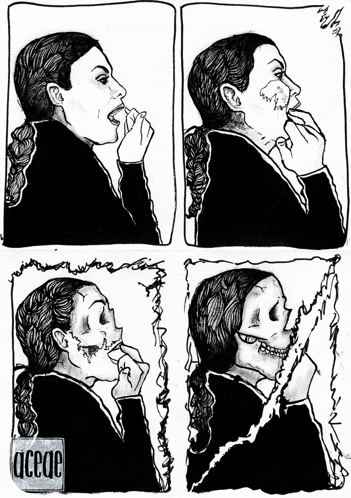

AIOD (All In One Day) is a work-in-progress graphic novel documenting my first visit to Latvia, where my parents were born and raised, to meet my grandmother and bring her to the United States. It’s the story of mental health, ageing, immigration, and a dark sense of humour spanning several generations.

Digital and physical illustration, photography and video, to be released online in parts.

