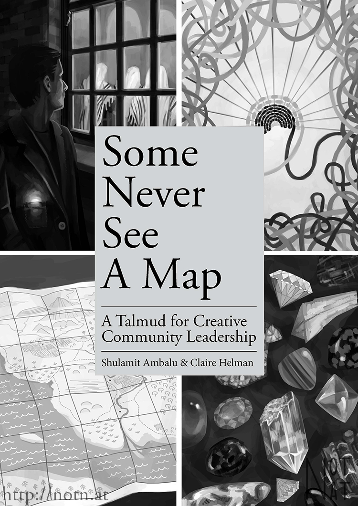
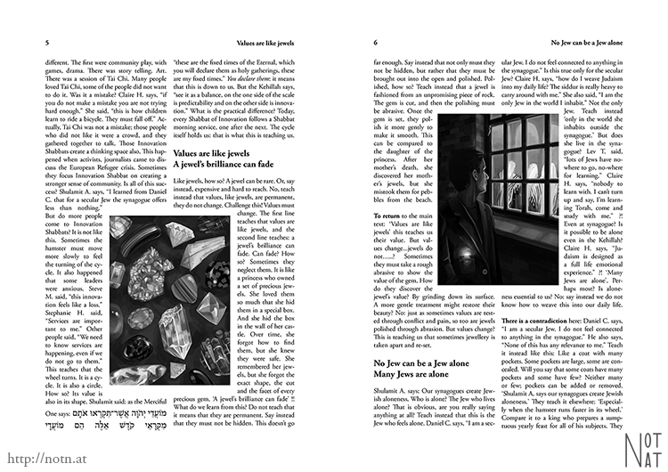
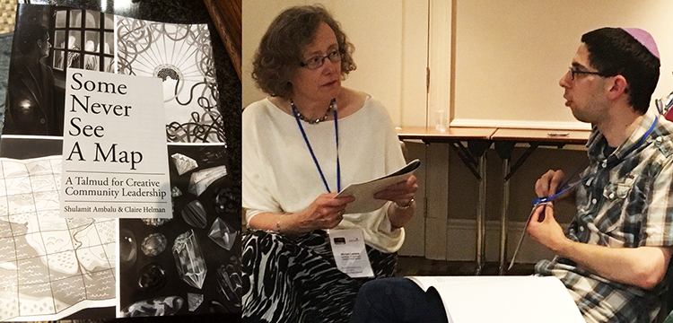

I worked with [Kehillah London](http://kehillah.org.uk/) and illustrator [Amy Beaumont](http://morbidlemon.co.uk/) to create an alternative, illustrated Talmud. I was provided with text and illustrations which I chose to arrange in the traditional style of the Talmud (shown [here](http://murals.wbtla.org/uploads/2/4/7/9/24790045/786846_orig.jpg) and [here](https://upload.wikimedia.org/wikipedia/commons/f/f2/First_page_of_the_first_tractate_of_the_Talmud_(Daf_Beis_of_Maseches_Brachos).jpg)). This provided a unique design challenge: to take English, Hebrew, and images and arrange them to aesthetically replicate what originally is in Hebrew. The print copy was debuted at the Liberal Judaism Biennial.

Indesign, 2016.

