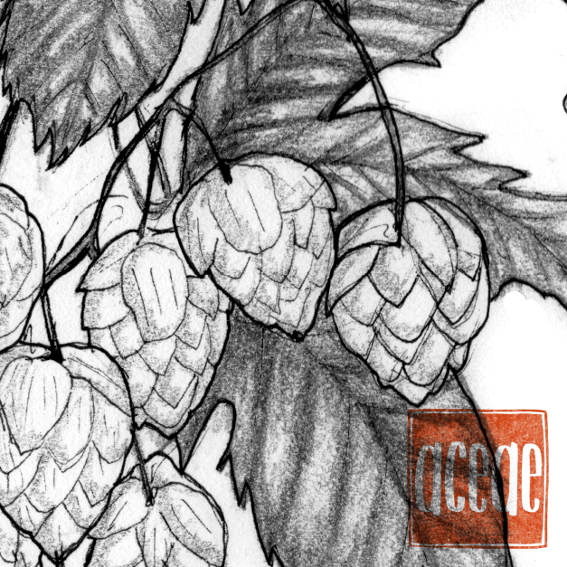

Commissioned botanical illustrations for London-based soda company, [Square Root London](http://squarerootsoda.co.uk). I produce illustrations of key ingredients for new flavours which the owners incorporate into their label design.

Ink and pencil, ongoing. Photos by [Charlie McKay](http://www.charliemckay.com/).

Strawberry Flower

Cedrata/Etrog

Rhubarb

Peach

Blood orange, peach, and cucumber

Wormwood

Hops

